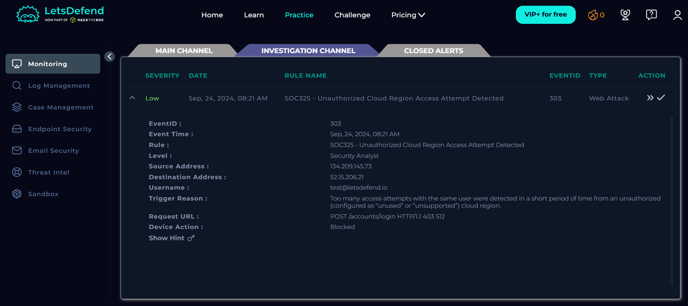
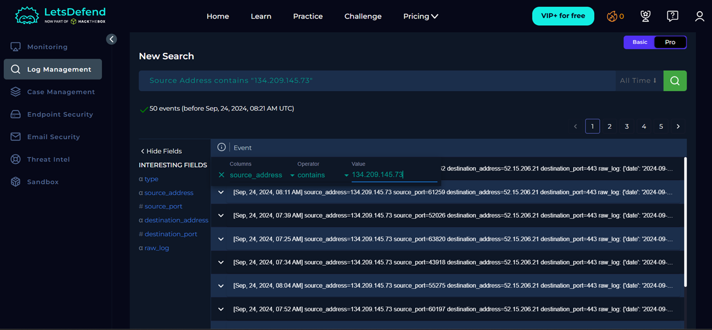
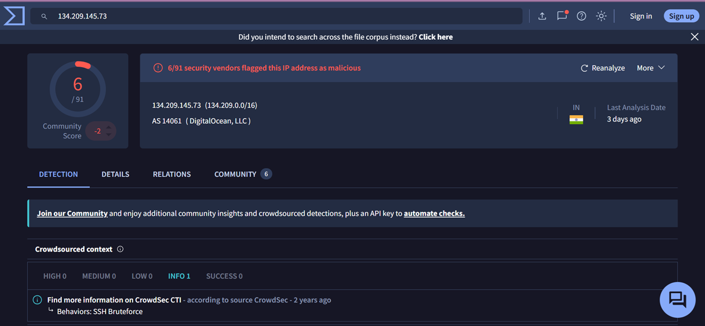

# SOC325 - Unauthorized Cloud Region Access Attempt Detected

## Summary

This alert was triggered due to repeated login attempts from an unauthorized cloud region targeting the account `test@letsdefend.io`.

**Final Verdict:** True Positive

---

## Alert Information

- **Alert ID:** 303
- **Severity:** Low
- **Date:** Sep 24, 2024, 08:21 AM
- **Event Type:** Web Attack

---

## Investigation

- Reviewed the alert details.
- Searched the source IP (`134.209.145.73`) in Log Management.
- Found 50 related log events.
- Analyzed the firewall logs.
- Verified the affected endpoint.
- Checked the IP reputation using VirusTotal.

---

## Evidence

### Alert Details

### Log Management

### VirusTotal

---

## Findings

- Source IP: **134.209.145.73**
- Destination IP: **52.15.206.21**
- User: **test@letsdefend.io**
- Host: **AWS_Services**
- OS: **Ubuntu 20.04.02**
- Firewall Action: **Blocked (access_denied)**
- Only one endpoint was affected.
- VirusTotal marked the source IP as suspicious.

---

## Conclusion

The investigation confirmed a **True Positive** alert. The attacker repeatedly attempted to access the login page from an unauthorized cloud region. The firewall blocked all requests, preventing unauthorized access, and no compromise of the endpoint was observed.

---

## What I Learned

- Searching logs using an IP address.
- Reading firewall log entries.
- Identifying IOCs.
- Checking IP reputation with VirusTotal.
- Determining the scope of an incident.