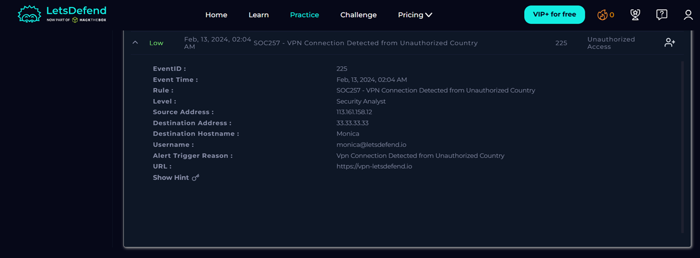
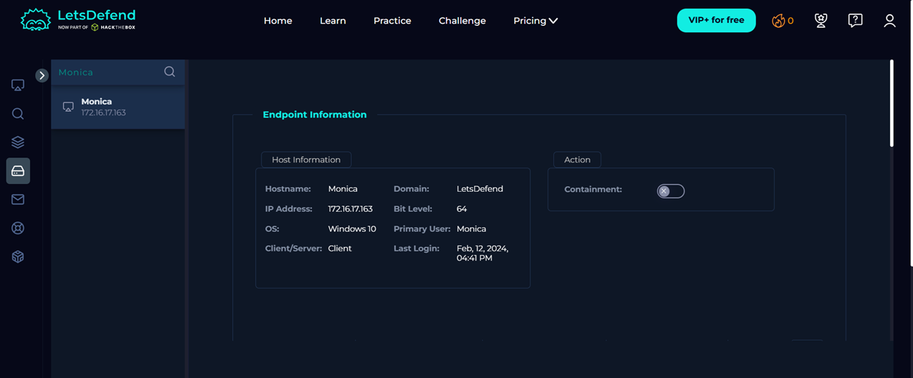

# Case 02 - SOC257: VPN Connection Detected from Unauthorized Country

## Alert Information

| Field | Value |
|-------|-------|
| Alert ID | 225 |
| Alert Name | SOC257: VPN Connection Detected from Unauthorized Country |
| Severity | Low |
| Date | February 13, 2024 |
| Time | 02:04 AM |
| Event Type | Unauthorized Access |

--- 

## Investigation Summary

This alert detected a VPN connection originating from an unauthorized country. The investigation focused on analyzing firewall logs, identifying the affected endpoint, reviewing Threat Intelligence, and determining whether the activity represented a real security incident.

The source IP address generated multiple firewall events targeting a single endpoint. Threat Intelligence identified the IP as suspicious with a Brute Force reputation. No malicious processes or evidence of endpoint compromise were identified during the investigation.

---

## Investigation Steps

- Reviewed alert details
- Investigated firewall logs in Log Management
- Reviewed endpoint information
- Checked IOC reputation using Threat Intelligence
- Evaluated containment and eradication requirements
- Recorded findings and closed the incident

---

## Final Verdict

**True Positive**

The alert correctly detected suspicious VPN activity originating from an unauthorized country. The source IP address had a malicious reputation associated with Brute Force activity.

---

## Evidence Collected

- Source IP: **113.161.158.12**
- Destination IP: **33.33.33.33**
- User: **monica@letsdefend.io**
- Endpoint: **Monica**
- Operating System: **Windows 10**
- Log Type: **Firewall**
- Related Events: **21**
- IOC Reputation: **Brute Force (AbuseCH)**

---
 
## Files

- IOC.md
- Timeline.md
- Lessons-Learned.md

---

## Screenshots

### Alert Details

### Endpoint Information

