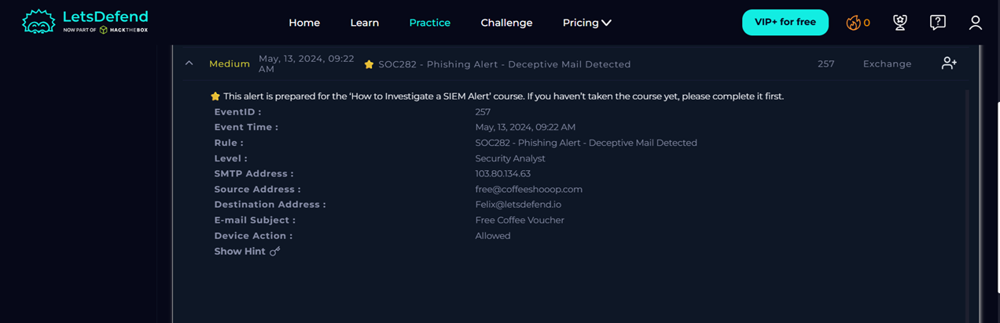
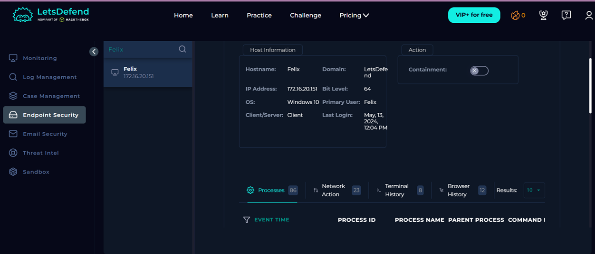
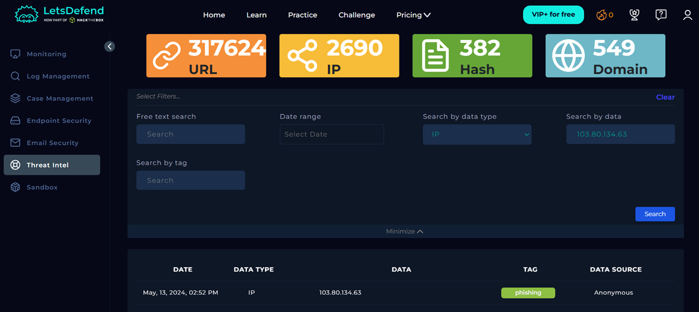

# Case 03 - Phishing Alert - Deceptive Mail Detected

## Alert Summary

| Field | Value |
|------|------|
| Alert Name | SOC282 - Phishing Alert - Deceptive Mail Detected |
| Event ID | 257 |
| Severity | Medium |
| Date | May 13, 2024 |
| Event Type | Exchange |

---

## Investigation Summary

A phishing alert involving the email subject **"Free Coffee Voucher"** was investigated. The recipient was **Felix@letsdefend.io**.

The sender email used the domain **coffeeshooop.com**, which appears to be a typosquatted version of a legitimate domain. Threat Intelligence identified the SMTP IP **103.80.134.63** as malicious and associated with phishing activity.

Although no reputation data was available for the sender domain, multiple indicators—including the phishing-themed email, suspicious sender domain, and malicious SMTP IP—supported the conclusion that this was a genuine phishing attempt.

---

## Indicators of Compromise

- SMTP IP: 103.80.134.63
- Sender: free@coffeeshooop.com
- Domain: coffeeshooop.com

---

## Verdict

**True Positive**

---

## MITRE ATT&CK

- T1566 – Phishing

---

## Investigation Files

- IOC.md
- Timeline.md
- Lessons-Learned.md

---

## Screenshots

### Alert Details

### Endpoint Information

### Threat Intelligence

