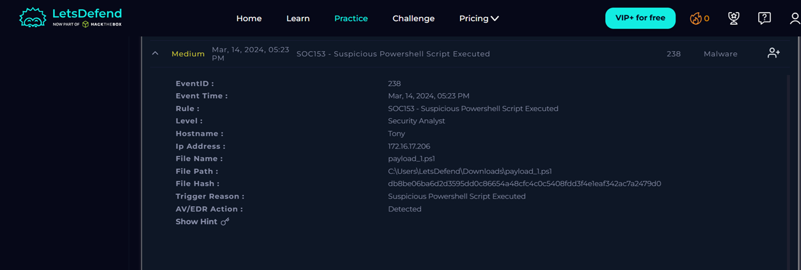
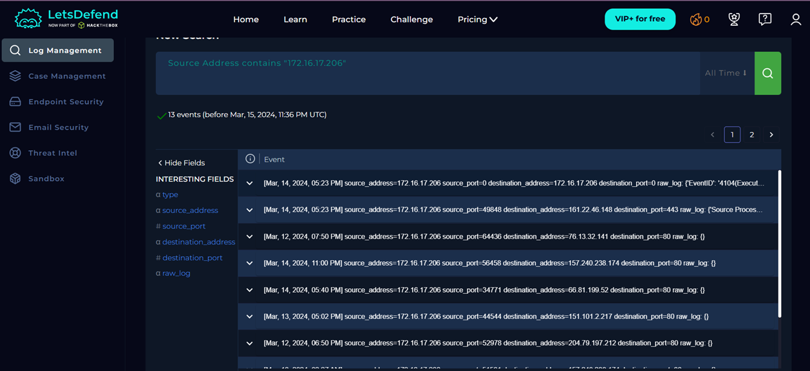

# Case 04 - Suspicious PowerShell Script Executed

## Alert Summary

| Field | Value |
|------|------|
| Alert Name | SOC153 - Suspicious PowerShell Script Executed |
| Event ID | 238 |
| Severity | Medium |
| Date | March 14, 2024 |
| Event Type | Malware Execution |

---

## Investigation Summary

A suspicious PowerShell script execution alert was investigated on the host **Tony**.

The investigation showed that `payload_1.ps1` was downloaded and executed successfully. Log Management revealed related firewall, proxy, and Windows event logs confirming script execution and outbound network communication. VirusTotal identified the file hash as malicious and classified it as a Trojan/Downloader.

---

## Indicators of Compromise

- File: `payload_1.ps1`
- SHA256 Hash
- External IP: `161.22.46.148`
- URL: `https://files-ld.s3.us-east-2.amazonaws.com/payload_1.ps1`

---

## Verdict

**True Positive**

---

## Investigation Files

- IOC.md
- Timeline.md
- Lessons-Learned.md

---

## Screenshots

### Alert Details

### Log Information

### Threat Intelligence

