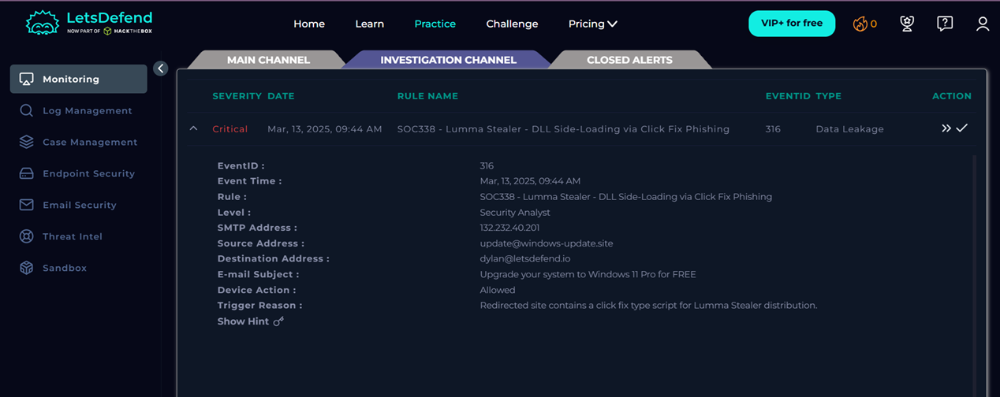
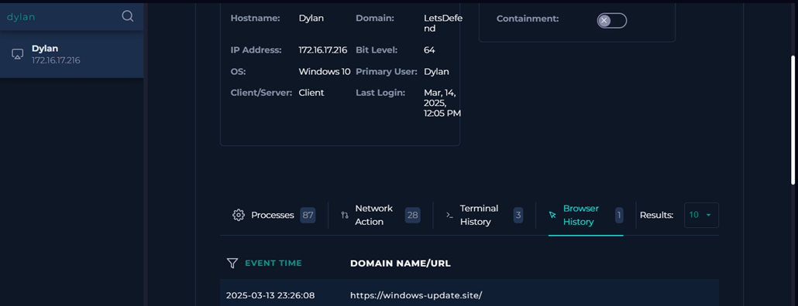
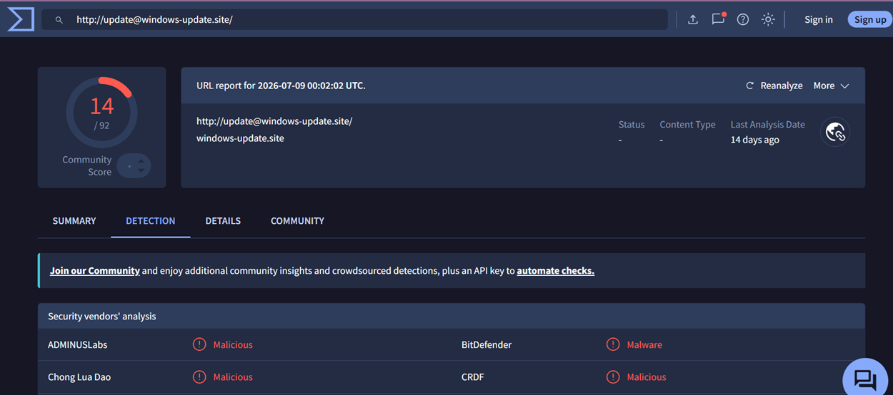

# SOC338 - Lumma Stealer - DLL Side-Loading via ClickFix Phishing

## Alert Information

| Field | Value |
|--------|--------|
| Alert Name | SOC338 - Lumma Stealer - DLL Side-Loading via ClickFix Phishing |
| Event ID | 316 |
| Severity | Critical |
| Event Time | Mar 13, 2025, 09:44 AM |
| Event Type | Data Leakage |
| Affected User | Dylan |

---

## Investigation Summary

The alert was triggered after a phishing email related to a fake Windows 11 upgrade was delivered to the user. Browser history showed that the user visited `https://windows-update.site`, which redirected to a ClickFix phishing page.

The investigation revealed that **Windows Explorer** launched **powershell.exe**, which subsequently executed **mshta.exe**. The `mshta.exe` process accessed the remote URL:

`https://overcoatpassably.shop/Z8UZbPyVpGfdRS/maloy.mp4`

This execution chain is consistent with the **ClickFix phishing technique**, where users are tricked into executing PowerShell commands that retrieve malicious content.

Threat Intelligence analysis identified the associated infrastructure as malicious and linked to Lumma Stealer distribution.

Based on the browser activity, process execution, command-line evidence, and malicious infrastructure, the alert was classified as a **True Positive**.

---

## Root Cause

The user visited a malicious website associated with a ClickFix phishing campaign, leading to the execution of PowerShell and `mshta.exe`, which attempted to retrieve additional malicious content.

---

## Verdict

✅ True Positive

---

### Alert Details

### Endpoint Information

.png)

### Threat Intelligence

