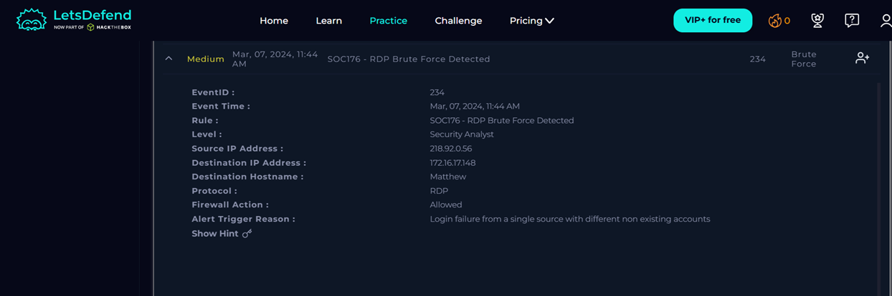
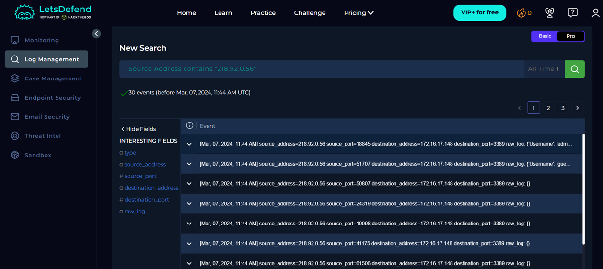
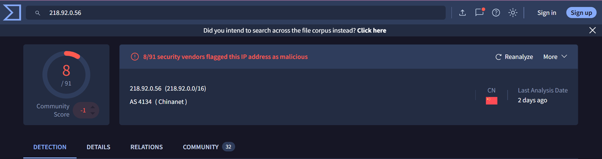

# SOC176 - RDP Brute Force Detected

## Alert Information

| Field | Value |
|--------|--------|
| Alert Name | SOC176 - RDP Brute Force Detected |
| Event ID | 234 |
| Severity | Medium |
| Event Time | Mar. 07, 2024, 11:44 AM |
| Event Type | Authentication |
| Affected Host | Matthew |

---

## Investigation Summary

The alert was generated after multiple RDP login attempts were detected from the external IP address `218.92.0.56` targeting the internal host `172.16.17.148` over port **3389**.

Log analysis identified multiple failed Windows logon events (**Event ID 4625**) using non-existing accounts such as **admin** and **guest**. Firewall logs confirmed repeated RDP connection attempts from the same external IP. No successful logon event (**Event ID 4624**) was observed during the investigation.

Threat Intelligence analysis identified the source IP address as malicious.

Based on the collected evidence, the alert was classified as a **True Positive**. The brute-force attack was unsuccessful and the target endpoint was not compromised.

---

## Root Cause

An external attacker attempted an RDP brute-force attack against the internal Windows host by trying multiple usernames over port 3389.

---

## Verdict

✅ True Positive

---

### Alert Details

### Log Information

### Threat Intelligence

